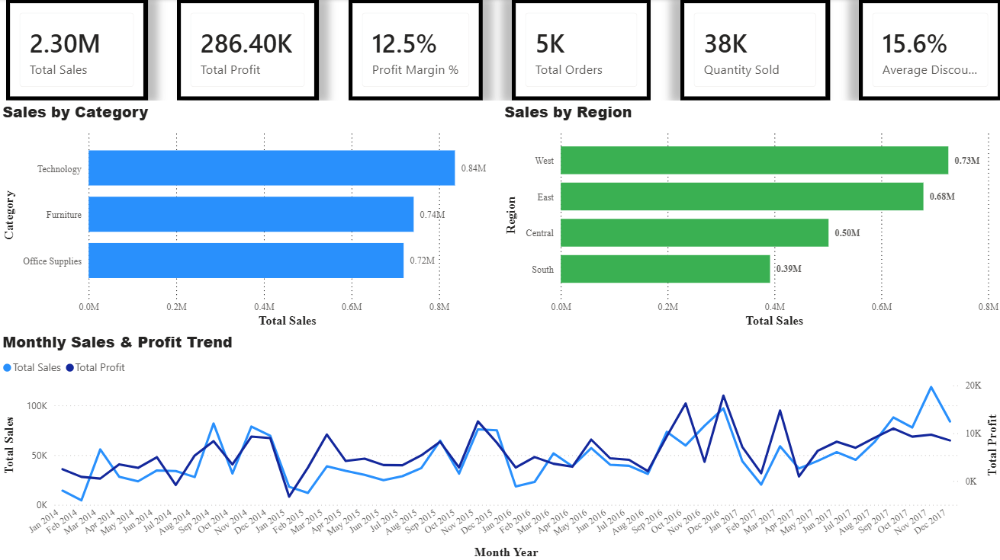

# Executive Retail Analytics Dashboard


## Project Overview

This project is an interactive Power BI dashboard built using the Sample Superstore dataset. The goal is to transform raw retail sales data into executive-level insights through clean visualizations, meaningful KPIs, and interactive reporting.

The dashboard is being developed as part of my professional data analytics portfolio to demonstrate practical business intelligence and data visualization skills.

## Project Highlights

- 📈 Built an executive-level Power BI dashboard using the Sample Superstore dataset.
- 📊 Developed interactive KPI cards to monitor business performance.
- 📅 Created a time-series analysis of monthly sales and profit trends.
- 🛍️ Visualized sales performance by product category.
- 🌎 Compared regional sales performance across four business regions.
- ⚡ Utilized DAX measures and Power Query for data modeling and business calculations.
- 🎯 Designed with executive reporting and business decision-making in mind.

---

## Business Objectives

This dashboard answers several important business questions:

* How is the business performing overall?
* Which product categories generate the most revenue?
* Which regions contribute the most sales?
* How have sales and profits changed over time?
* Which business metrics should executives monitor regularly?

---

## Current Dashboard Features

### Executive Overview

* Total Sales KPI
* Total Profit KPI
* Profit Margin
* Total Orders
* Quantity Sold
* Average Discount
* Monthly Sales & Profit Trend
* Sales by Category
* Sales by Region

---

## Technologies Used

* Power BI
* Power Query
* DAX
* Data Modeling
* Microsoft Excel
* Git & GitHub

---

## Skills Demonstrated

* Data Cleaning
* Data Modeling
* DAX Measures
* KPI Development
* Dashboard Design
* Business Intelligence Reporting
* Data Visualization
* Executive Reporting

---

## Project Status

🚧 Currently in active development.

Planned additions include:

* Customer Analysis
* Product Intelligence
* Shipping Performance
* Executive Insights
* Interactive slicers
* Dashboard optimization and polish

---

## Repository Structure

```text
Executive-Retail-Analytics-Dashboard/
│
├── README.md
├── Dashboard.pbix
├── Images/
├── Data/
└── Docs/
```

---

## Author

**Jesse Luffman**

Bachelor of Information Technology student with a concentration in Data Analytics, building a portfolio of real-world business intelligence and analytics projects using Power BI.
