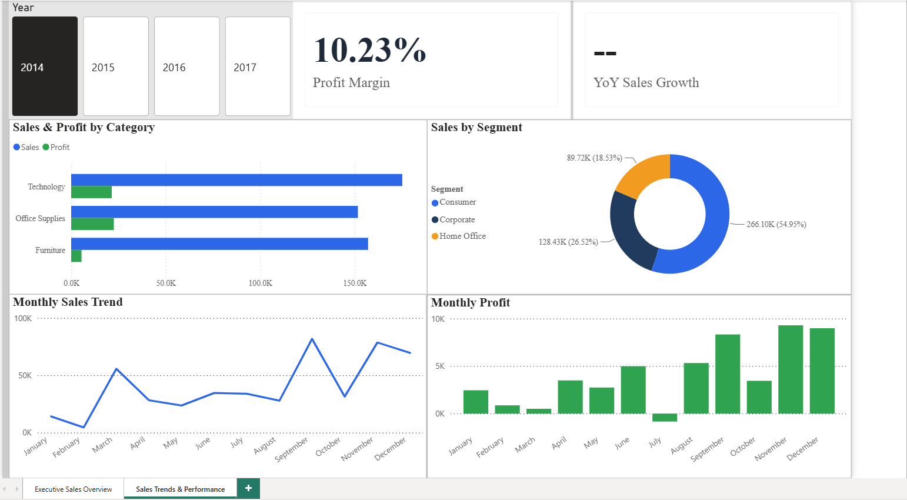
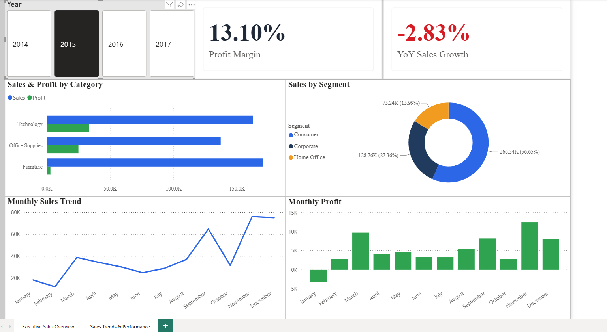
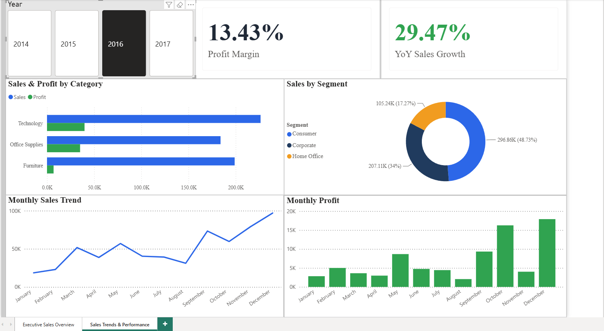
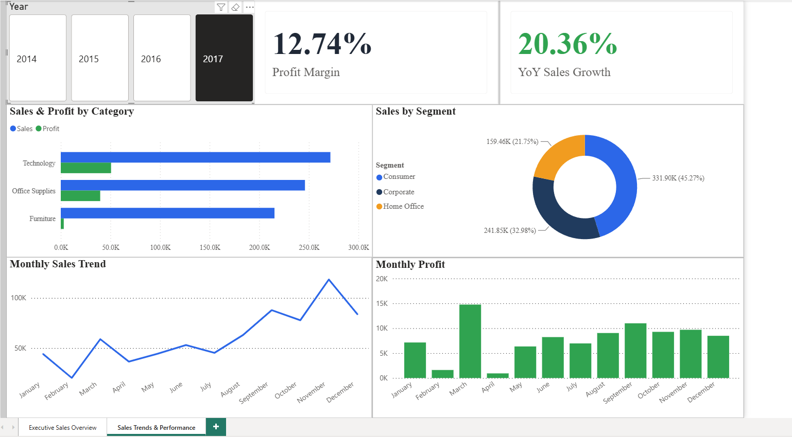

# Executive Retail Analytics Dashboard

> **Power BI portfolio project transforming retail transaction data into an executive-level view of revenue, profitability, customer activity, regional performance, and year-over-year growth.**


## Executive Summary

This project was built to answer a practical leadership question: **How is the business performing, what is driving the result, and where should management look next?**

Using the Sample Superstore retail dataset, I developed a two-page Power BI report that moves from a high-level executive overview into year-specific performance analysis. The dashboard combines sales, profit, margin, customers, orders, categories, regions, customer segments, and monthly trends in one interactive reporting experience.

Across the complete reporting period, the business generated **$2.30M in sales** and **$286.40K in profit** from approximately **5,000 orders** and **793 customers**. Overall **profit margin was 12.47%**, with an **average order value of $458.61**.

The report shows that revenue growth alone does not tell the full story. Technology and the West lead their respective dimensions, while year-over-year results reveal a 2015 decline followed by a substantial 2016 recovery and continued growth in 2017. Profitability, however, does not move perfectly with sales, making margin an essential companion metric to revenue.

---

## Business Questions

The dashboard was designed around questions an executive or business manager could reasonably ask:

- How much revenue and profit is the business generating?
- Is the company converting sales into profit efficiently?
- Which product categories and geographic regions contribute the most revenue?
- How many customers and orders support that performance?
- How has performance changed from one year to the next?
- Which customer segments contribute most to sales?
- Do monthly sales and profit move together?
- Where do the results suggest management should investigate further?

Rather than treating the dashboard as a collection of charts, I designed each visual to contribute to one of these decisions.

---

## Executive Performance Overview

The first report page gives leadership an immediate view of overall business performance before moving into the underlying drivers.

### Key Performance Indicators

| KPI | Result |
| --- | ---: |
| **Total Sales** | **$2.30M** |
| **Total Profit** | **$286.40K** |
| **Total Orders** | **~5K** |
| **Total Customers** | **793** |
| **Profit Margin** | **12.47%** |
| **Average Order Value** | **$458.61** |

These KPIs establish scale, customer activity, and profitability simultaneously. Sales and profit show the financial result, orders and customers provide operating context, while profit margin and average order value help explain the quality and value of those transactions.

### Category Performance

**Technology is the strongest category by sales at approximately $0.84M**, followed by **Furniture at $0.74M** and **Office Supplies at $0.72M**.

The gap is meaningful but not overwhelming: all three categories contribute substantial revenue. That makes Technology an important growth driver without making the business completely dependent on a single category.

### Regional Performance

The **West leads regional sales at approximately $0.73M**, followed by the **East at approximately $0.68M**. Central and South trail the two leading regions.

For management, that difference creates two useful lines of inquiry: what is working in the West and East, and whether weaker regions represent an improvement opportunity or simply different market potential.

### Sales vs. Profit

One of the most important patterns in the report is that **sales and profit do not always move proportionally**. A high-revenue period is not automatically an equally strong profit period.

That distinction is why the dashboard keeps profit and margin visible alongside sales rather than allowing revenue to become the sole definition of performance.

---

## Year-over-Year Analysis

The second page turns the report from a static summary into an interactive diagnostic tool. A year slicer updates the supporting visuals so the same business measures can be compared consistently across reporting periods.

The page tracks:

- Profit margin
- Year-over-year sales growth
- Category performance
- Customer segment mix
- Monthly sales
- Monthly profit

### 2014 — Baseline Year



2014 establishes the baseline for subsequent year-over-year comparisons. Because no 2013 observations exist in the dataset, a valid prior-year comparison cannot be calculated for 2014. The dashboard intentionally leaves year-over-year growth unavailable rather than presenting a misleading value.

That behavior is a deliberate analytical choice: **missing comparison data should remain missing rather than being converted into a false zero or fabricated result.**

### 2015 — Contraction



Sales declined **2.83% year over year in 2015**, making it the only negative-growth year in the available comparison period. Despite the revenue decline, profit margin finished at **13.10%**.

Monthly performance was uneven, with stronger late-year sales helping offset weaker periods earlier in the year. This is a useful example of why annual KPIs and monthly trends belong together: the annual result tells management *what* happened, while the monthly view begins to show *when* it happened.

### 2016 — Strong Recovery



2016 marks the strongest turnaround in the dataset. Sales increased **29.47% year over year**, the largest annual growth rate shown in the report, while profit margin improved to **13.43%**.

Sales strengthened particularly during the second half of the year and finished strongly in the final months. Compared with the 2015 decline, the shift demonstrates a significant improvement in top-line performance without sacrificing margin.

### 2017 — Continued Growth, Margin Pressure



Growth continued in 2017 at **20.36% year over year**, confirming that the 2016 rebound was not simply a one-year increase. Profit margin, however, decreased to **12.74%**.

That combination is analytically important. Revenue continued expanding, but profitability did not improve at the same rate. For a decision-maker, that would justify deeper analysis into factors such as product mix, discounting, shipping costs, regional mix, or individual low-margin products before assuming that additional sales automatically represent better performance.

---

## Four-Year Performance Story

Viewed together, the annual pages tell a clearer story than any single KPI:

| Year | YoY Sales Growth | Profit Margin | Interpretation |
| --- | ---: | ---: | --- |
| **2014** | N/A | — | Baseline year; no prior-year comparison available |
| **2015** | **-2.83%** | **13.10%** | Sales contraction |
| **2016** | **+29.47%** | **13.43%** | Strongest recovery and strongest displayed margin |
| **2017** | **+20.36%** | **12.74%** | Continued growth with margin pressure |

The key takeaway is not simply that sales increased over time. The more useful conclusion is that **growth and profitability need to be evaluated together**. The strongest revenue expansion occurred in 2016, while 2017 maintained impressive growth but produced a lower margin.

---

## Customer and Market Insights

### Customer Segment

The **Consumer segment contributes the largest share of sales** in the yearly views. This makes consumer purchasing behavior particularly important when evaluating changes in overall business performance.

Rather than viewing segment contribution in isolation, the interactive page allows it to be considered alongside annual growth, category results, and monthly trends.

### Geography

West and East generate the strongest regional sales across the complete reporting period. The difference between leading and trailing regions gives management a natural starting point for deeper investigation into customer concentration, product demand, discounting, and profitability by geography.

### Product Mix

Technology's position as the leading category makes it an important revenue driver. At the same time, the relatively meaningful contribution from Furniture and Office Supplies indicates a diversified revenue base rather than complete dependence on one product family.

---

## Management Takeaways

The analysis points to several practical conclusions:

1. **Revenue performance recovered decisively after 2015.** The business moved from a 2.83% decline to 29.47% growth in 2016 and another 20.36% in 2017.
2. **Growth should not be evaluated without profitability.** The 2017 margin decline to 12.74% despite strong sales growth shows why profit and margin need to remain part of executive reporting.
3. **Technology is the leading product category**, but all three major categories make meaningful contributions to total sales.
4. **West and East are the strongest sales regions**, creating an opportunity to compare the characteristics of leading and trailing markets.
5. **Consumer customers represent the largest sales segment**, making that group especially important to overall performance.
6. **Monthly sales and profit patterns provide context that annual KPIs cannot.** They help identify when performance changes occurred and where further investigation should begin.

These findings are **descriptive rather than causal**. The dashboard identifies patterns and areas requiring attention; determining why those patterns exist would require additional analysis of factors such as discounts, product-level profitability, shipping, customer behavior, and market conditions.

---

## Dashboard Design & Analytical Approach

I designed the report around a **summary-to-detail workflow**.

The first page is intended for rapid executive consumption: high-value KPIs and the major category, region, and time-based drivers are visible without requiring the user to navigate through raw records.

The second page changes the purpose from monitoring to investigation. The year slicer allows the user to hold the report structure constant while changing the period being analyzed. This makes year-to-year differences easier to interpret because the visual framework remains consistent.

The design intentionally emphasizes:

- Clear KPI hierarchy
- Consistent visual formatting
- Limited visual clutter
- Business-readable titles
- Interactive filter context
- Comparable year-specific views
- Revenue and profitability shown together

---

## Data Model & DAX

The project was developed in **Microsoft Power BI** using the Sample Superstore dataset.

A dedicated **Date Table** supports monthly reporting and year-over-year analysis, while reusable DAX measures keep business logic separate from the underlying transaction fields.

### Core Measures

The report includes measures for:

- Total Sales
- Total Profit
- Total Orders
- Total Customers
- Average Order Value
- Profit Margin
- Year-over-Year Sales Growth %

### Example Business Logic

**Profit Margin** evaluates profit relative to sales rather than looking at profit dollars alone:

```DAX
Profit Margin =
DIVIDE(
    [Total Profit],
    [Total Sales]
)
```

**Average Order Value** connects total revenue to transaction volume:

```DAX
Average Order Value =
DIVIDE(
    [Total Sales],
    [Total Orders]
)
```

The year-over-year calculation uses the Date Table and prior-year context so each selected period is compared with its valid predecessor. Because 2014 has no prior-year observations, the report intentionally does not manufacture a comparison value.

---

## What This Project Demonstrates

This project demonstrates more than the ability to build Power BI visuals. It shows an end-to-end business intelligence workflow:

**Business framing** — selecting measures and visuals based on management questions rather than chart variety.

**Data modeling** — using a dedicated date dimension and reusable measures to support consistent analysis.

**DAX development** — creating KPIs, ratios, and time-intelligence calculations that respond correctly to filter context.

**Analytical reasoning** — distinguishing revenue growth from profitability and avoiding unsupported causal claims.

**Dashboard design** — organizing information so executives can understand the overall result quickly and investigate it without leaving the report.

**Communication** — translating numerical results into business implications rather than presenting charts without interpretation.

---

## Tools & Skills

**Power BI · Power Query · DAX · Data Modeling · Data Cleaning · Time Intelligence · KPI Development · Interactive Reporting · Data Visualization · Business Analysis · Git · GitHub**

---

## Dataset

The project uses the **Sample Superstore** retail dataset, containing order-level information covering sales, profit, customers, products, categories, discounts, shipping, dates, and geographic regions.

The source dataset is included in the repository's `Data` directory for reproducibility.

---

## Repository Structure

```text
Executive-Retail-Analytics-Dashboard/
├── README.md
├── ExecutiveRetailAnalyticsDashboard.pbix
├── Images/
│   ├── ExecutiveDashboard.png
│   ├── SalesTrends2014.png
│   ├── SalesTrends2015.png
│   ├── SalesTrends2016.png
│   └── SalesTrends2017.png
└── Data/
    └── Sample - Superstore.csv
```

---

## Project Status

**Completed — August 2026**

The final Power BI report contains an **Executive Sales Overview** and an interactive **Sales Trends & Performance** page covering all four years available in the dataset.

---

## Author

### Jesse Luffman

Data analytics professional and Bachelor of Information Technology student focused on transforming business data into clear, decision-oriented reporting through business intelligence, data visualization, and analytical reasoning.
